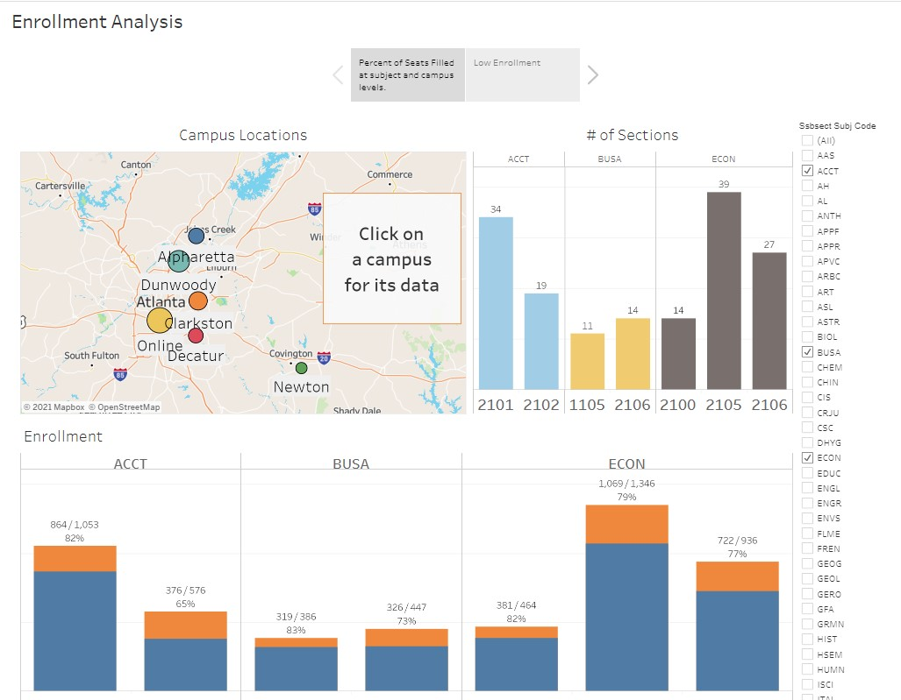
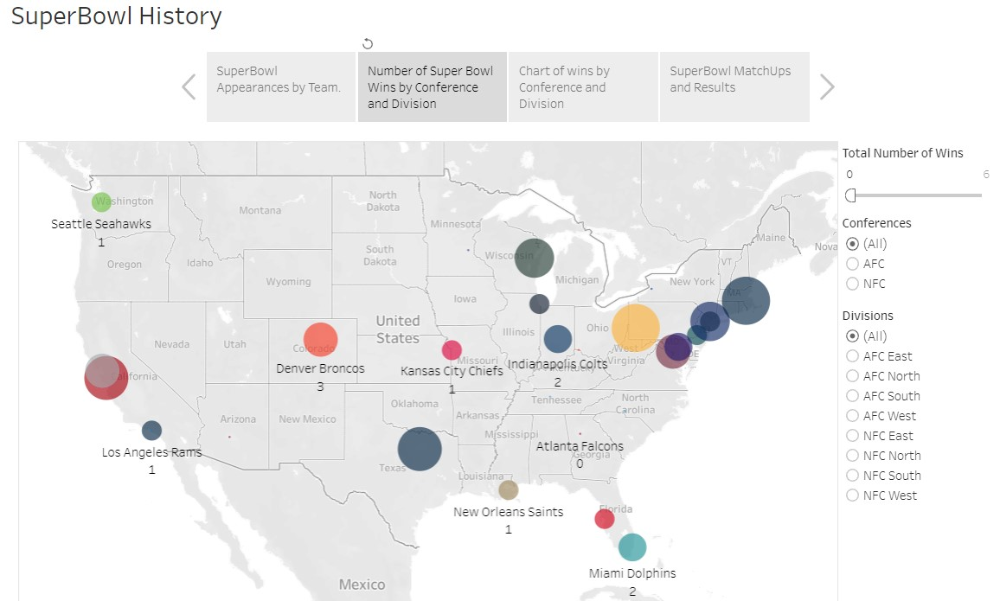
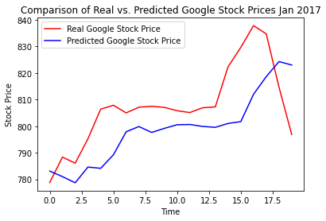
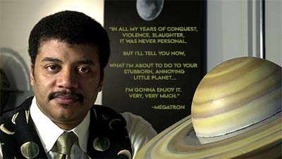

#### [GitHub Repository](https://github.com/brownt47)  
### [Resume](https://github.com/brownt47/Resume/blob/master/Timothy_Brown_Resume.pdf)  
My name is Timothy Brown, and I am a tech-savvy academic looking to tackle challenging new problems. 

It is my nature to solve problems and improve existing solutions using my strong analytical and quantitative skills. Comfortable working with decision-makers, I also thrive in dynamic and collaborative environments and have solid verbal and written communication skills. I enjoy working with data to develop and build models that inform decision-making. I enjoy learning and have completed numerous online courses covering topics ranging from machine learning to graphic design.
 

#### Tableau Public Projects [(link)](https://public.tableau.com/profile/timothy.brown2096#!/)  
  * [Course Enrollment Dashboard](https://public.tableau.com/profile/timothy.brown2096#!/vizhome/AlpharettaProject/Story1)  
  * Dashboard to show enrollment levels in various subjects, courses and campuses.  Can identify "low enrollment" classes measure impact of cancelling courses based on a threshold parameter.

  

* [NFL SuperBowl Dashboard](https://public.tableau.com/app/profile/timothy.brown2096/viz/SuperBowlProject/SuperBowlHistory)  
  * Dashboard showing various facts about past NFL Super Bowls up-to 2019.
  * The Patriots attending so many Super Bowls added some vizualization challenges.

  

 

#### Natural Language Processing (NLP) Projects  
* [Fake News Classification using Google's BERT - GitHub](https://github.com/brownt47/NLP_Projects/blob/main/BERT%20NLP%20Classification.md)
  * Training a BERT model to classify fake news articles.
  * Data from a Kaggle [Fake News competition](https://www.kaggle.com/c/fake-news/overview).
  * Results place it in the top 3.  

* [Parler ChatBot - GitHub](https://github.com/brownt47/NLP_Projects/blob/main/Parler_ChatBot.ipynb)
  * Natural language generation using Markov chains with [Markovify](https://github.com/jsvine/markovify). 
  * Built on the comments from the leaked Parler data set found [here](https://zenodo.org/record/4442460).
  * Favorite result: *"Chuck Todd "NBC NEWS" wants to know what Batman’s handwriting looks like."* 
 

#### Deep Learning Projects  
* [Predicting Google Stock Prices - GitHub](https://github.com/brownt47/Deep_Learning/blob/main/rnn.py)
  * Built an LSTM model to predict one month of stock prices for Google in January 2017

      

 

#### PhotoShop Projects [(link)](https://brownt47.github.io/Photoshop/)  
  * Collection of projects involving product placements, photo retouching, old photo restorations, object removals and some creative fun.

 

 

#### Stats Lectures [(link)](https://brownt47.github.io/YouTubeLectures/)  
  * Few of the lectures I prepared when classes switched to online in the spring of 2021 due to the pandemic.

<iframe width="300" src="https://www.youtube.com/embed/QrbdBnbgTEo" title="YouTube video player" frameborder="0" allow="accelerometer; autoplay; clipboard-write; encrypted-media; gyroscope; picture-in-picture" allowfullscreen></iframe>

 

#### Python Projects [(link)](https://brownt47.github.io/Python_Projects/)  
  * Collection of python projects used to analyze course enrollment data and generate excel reports. Makes use of pandas, nympy, xlsxwriter and others.

 

#### R Projects  
  * [Solutions for "R for Data Science" by Hadley Wickham](https://brownt47.github.io/R-For-Data-Science-Solutions) 
    * Some of the other solution guides for the book used R structures and methods not introduced in this text.  I wanted to write a solution manual that assumes no previous R experience and only uses methods described in the book.  Still a passion project in progress.
  * [link to book](https://r4ds.had.co.nz/)  
 

#### VBA Projects  
* [Image Resizing and Hyperlink Insertion  in Word - GitHub](https://github.com/brownt47/VBA-Projects/blob/main/ResizeImage.md)
  * This is a macro that will resize a selected image and attach a hyperlink to the image. It will also add the hyperlink as text below the image.

* [Course Enrollment Report Processing in Excel - GitHub](https://github.com/brownt47/VBA-Projects/blob/main/CrossListedCourses.md)  
  * This is a VBA macro I wrote to address an issue with how enrollment reports displayed one course that had multiple cross-listings.  In order for one department to know how many students were enrolled in different courses, one would have to find all the cross-listed sections and then manually add them together.  This macro would automate that process across hundreds of cross-listed courses among all disciplines and campuses.
 

#### Scala and Spark Projects  
* [Processing Consumer Purchasing Data - GitHub](https://github.com/brownt47/Scala/blob/main/CustomerPurchasing.md)
  * Project was to total the combined purchases of each customer with a reduce function. Then sort the data by those totals. I added a challenge of finding those with spendatures greater than some predetermined amount.
 

 
#### Interesting Books and Research Publications  
* [How to Read a Paper - S. Keshav (pdf)](https://web.stanford.edu/class/ee384m/Handouts/HowtoReadPaper.pdf)  
  * A research paper on how to read research papers.  Truly a standout in the field of meta.

* [Particle Swarm Optimization (PSO) Visually Explained - TowardDataScience.com](https://towardsdatascience.com/particle-swarm-optimization-visually-explained-46289eeb2e14)  
  * Learn PSO algorithm as a bedtime story with GIFs and python code

* [Solutions for "R for Data Science" by Hadley Wickham](https://r4ds.had.co.nz/)
  * Free eBook to help one get started in Data Science.  Baseball projects are great for sports junkies.

